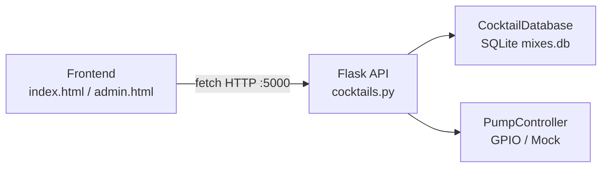
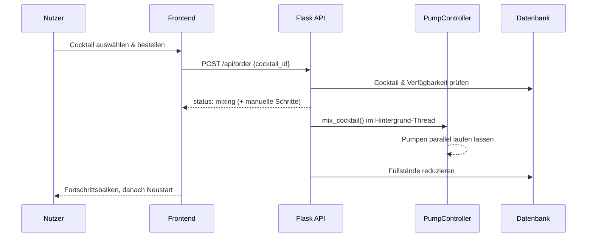

# Cocktailmixer – Projektdokumentation

Diese Datei erklärt das gesamte Projekt: Aufbau, Backend, Frontend, Datenbank
und den Ablauf einer Bestellung. Sie richtet sich an Entwickler:innen, die das
Projekt verstehen, starten oder erweitern möchten.

---

## 1. Überblick

Das Projekt ist eine **Cocktailmaschine** und besteht aus zwei Teilen:

- **Backend (Python / Flask):** steuert die 19 Pumpen über GPIO-Pins,
  verwaltet Rezepte und Zutaten in einer SQLite-Datenbank und stellt eine
  REST-API bereit.
- **Frontend (HTML / CSS / JavaScript):** Touch-Oberfläche zum Auswählen und
  Bestellen von Cocktails sowie ein passwortgeschützter Admin-Bereich.



---

## 2. Projektstruktur

```
Cocktailmixer_LF12a/
├── api_examples.html          # Endpunkt-Übersicht zum Testen der API
├── README.md
├── DOKUMENTATION.md           # diese Datei
├── py/scripts/backend/
│   ├── app.py                 # Einstiegspunkt (Flask-App)
│   ├── requirements.txt       # Python-Abhängigkeiten
│   ├── api/
│   │   └── cocktails.py       # REST-API (Blueprint)
│   ├── core/
│   │   └── pump_controller.py # Hardware-/GPIO-Steuerung
│   └── database/
│       ├── cocktail_db.py     # Datenbankzugriff
│       └── mixes.db           # SQLite-Datenbank
└── src/
    ├── css/                   # style.css / style.scss
    ├── html/
    │   ├── index.html         # Haupt-Oberfläche
    │   └── admin.html         # Admin-Bereich
    ├── icons/ · images/
    └── js/
        ├── scripts.js         # Logik der Haupt-Oberfläche
        └── alerts.js          # Benachrichtigungssystem
```

---

## 3. Installation & Start

### Voraussetzungen

- Python 3 mit einem virtuellen Environment (`.venv/` im Projekt-Root)
- Auf dem Raspberry Pi zusätzlich `RPi.GPIO` (nur dort installierbar)

### Abhängigkeiten installieren

```bash
cd /run/media/hepa/rootfs/home/schule/Desktop/Cocktailmixer_LF12a
source .venv/bin/activate
pip install -r py/scripts/backend/requirements.txt
```

> Hinweis: `RPi.GPIO` lässt sich nur auf einem Raspberry Pi installieren.
> Auf einem normalen PC einfach nur `Flask` und `Flask-CORS` installieren –
> der Pump-Controller schaltet dann automatisch in den Simulationsmodus
> (siehe Abschnitt 4.2).

### Backend starten

```bash
cd py/scripts/backend
python app.py
```

Der Server läuft danach auf `http://localhost:5000` (bzw. `http://0.0.0.0:5000`).

Ohne aktiviertes venv geht es auch direkt:

```bash
/run/media/hepa/rootfs/home/schule/Desktop/Cocktailmixer_LF12a/.venv/bin/python \
    py/scripts/backend/app.py
```

### Weboberfläche öffnen

Das Frontend wird **nicht** von Flask ausgeliefert – es sind eigenständige
HTML-Dateien, die die API aufrufen. Am zuverlässigsten über einen kleinen
Webserver:

```bash
cd src
python3 -m http.server 8080
# Browser: http://localhost:8080/html/index.html
```

Die Datei `api_examples.html` im Root ist nur eine Endpunkt-Übersicht zum Testen.

---

## 4. Backend im Detail

### 4.1 `app.py` – Einstiegspunkt

```python
app = Flask(__name__)
CORS(app)
app.register_blueprint(cocktails_bp, url_prefix='/api')
```

- Erstellt die Flask-App.
- `CORS(app)` erlaubt, dass das Frontend (andere Herkunft) die API aufrufen darf.
- Registriert alle API-Routen aus `cocktails.py` unter dem Präfix `/api`.
- `/` liefert eine JSON-Übersicht aller Endpunkte.
- `app.run(host='0.0.0.0', port=5000, debug=True)` startet den Server.

### 4.2 `core/pump_controller.py` – Hardware-Steuerung

Steuert die 19 Pumpen über die GPIO-Pins des Raspberry Pi.

- **`__init__`**: definiert `pump_pins` (Pumpen-Nummer → GPIO-Pin). Versucht
  `RPi.GPIO` zu laden. Auf einem PC schlägt das fehl (`ImportError` **oder**
  `RuntimeError`, weil kein Pi), und es wird ein **Mock-GPIO** genutzt, das nur
  Text ausgibt statt echte Pins zu schalten.
- **`setup_gpio`**: setzt alle Pins als Ausgang und auf `HIGH` (Pumpe aus –
  die Relais schalten invertiert, `LOW` = an).
- **`run_pump(pump_id, amount_ml)`**: schaltet eine Pumpe für eine berechnete
  Zeit ein. Kalibrierung: `amount_ml * 0.5` Sekunden (≈ 2 ml/s).
- **`mix_cocktail(recipe, name)`**: startet für jede flüssige Zutat einen
  **Thread**, sodass alle Pumpen **parallel** laufen, und wartet mit `join()`,
  bis alle fertig sind.
- **`test_pump` / `start_pump` / `stop_pump`**: einzelne Pumpen manuell steuern
  (Admin-Bereich).
- **`cleanup`**: gibt die GPIO-Ressourcen frei.

### 4.3 `database/cocktail_db.py` – Datenbankzugriff

Kapselt alle SQLite-Zugriffe auf `database/mixes.db`.

Schema (drei Tabellen plus Bildspalte):

- `drinks` – Getränke (Name, Alkohol-Flag, Beschreibung)
- `ingredients` – Zutaten (flüssig/manuell, aktueller Füllstand, Maximum)
- `recipies` – Verknüpfung Getränk ↔ Zutat mit Menge
- `drinks.image_data` – PNG-BLOB des jeweiligen Getränks

Bildtabelle anlegen und Bilder aus `src/images/` importieren:

```bash
cd py/scripts/backend
python database/migrate_drink_images.py
```

Die Migration legt `drinks.image_data` an, importiert die PNGs und entfernt eine
eventuell vorhandene alte `drink_images`-Tabelle. Die Bilder sind danach über
`/api/cocktails/<drink_id>/image` abrufbar.

Wichtige Methoden:

- **`get_available_cocktails`**: großer `JOIN` über alle drei Tabellen.
  Gruppiert die Zeilen pro Getränk und baut ein verschachteltes Objekt mit
  `liquid_recipe` (per Pumpe dosierbar) und `manual_ingredients` (z. B. Limette,
  Minze). Prüft über `_makeable`, ob genug von jeder Zutat vorhanden ist;
  nicht mixbare Cocktails werden herausgefiltert.
  Beachte: `pump_id = ing_id - 1`, weil Pumpen bei 0 zählen, IDs bei 1.
- **`get_alcoholic_cocktails` / `get_non_alcoholic_cocktails`**: filtern über
  das `Alkohol`-Flag.
- **`get_ingredients_status`**: liefert Füllstände aller Zutaten.
- **`update_ingredient_level`**: reduziert den Füllstand nach dem Mixen
  (`MAX(0, ...)` verhindert negative Werte).
- **`set_ingredient_level` / `refill_ingredient` / `refill_all_ingredients`**:
  Füllstände setzen bzw. auffüllen (Admin).
- **`_get_manual_instruction`**: erzeugt Textanweisungen für manuelle Zutaten.

### 4.4 `api/cocktails.py` – die REST-API (Blueprint)

Erstellt die gemeinsame `db`- und `pump_controller`-Instanz und definiert die
Endpunkte (Basis-Präfix `/api`).

**Cocktails**
| Methode | Pfad | Beschreibung |
|---|---|---|
| GET | `/cocktails` | Liste aller mixbaren Cocktails (optional `?alkoholisch=true/false`) |
| POST | `/order` | `{cocktail_id}` – startet das Mixen im Hintergrund-Thread |
| GET | `/status` | ob gerade gemixt wird + Statistik |

**Zutaten**
| Methode | Pfad | Beschreibung |
|---|---|---|
| GET | `/ingredients` | Füllstände aller Zutaten |
| POST | `/ingredients/set` | `{ingredient_id, level}` – Füllstand setzen |
| POST | `/ingredients/refill` | `{ingredient_id, amount}` – additiv auffüllen |
| POST | `/ingredients/refill_all` | `{level}` – alle auf Wert setzen |

**Pumpen**
| Methode | Pfad | Beschreibung |
|---|---|---|
| POST | `/test-pump/<id>` | Pumpe testweise laufen lassen |
| POST | `/pump/<id>/start` | Pumpe einschalten |
| POST | `/pump/<id>/stop` | Pumpe ausschalten |

**PIN-Verwaltung**
| Methode | Pfad | Beschreibung |
|---|---|---|
| POST | `/check-pin` | `{pin, purpose}` – PIN prüfen (`alcohol` oder `admin`) |
| POST | `/change-pin` | `{old_pin, new_pin}` – Alkohol-PIN ändern |

- Die Alkohol-PIN wird in `data/pin.json` gespeichert (Default `1234`).
- Die Admin-PIN ist fest im Code hinterlegt (`9999`).
- `POST /order` startet das Mixen in einem **Hintergrund-Thread**, damit die
  HTTP-Antwort nicht blockiert, reduziert danach die Füllstände und gibt bei
  Bedarf manuelle Anweisungen zurück.

> **Sicherheits-Hinweis:** PINs im Klartext in einer JSON-Datei und eine fest
> codierte Admin-PIN sind unsicher. Für ein Schulprojekt vertretbar, für echten
> Einsatz sollten PINs gehasht und serverseitig abgesichert werden.

---

## 5. Frontend im Detail

### 5.1 `src/html/index.html` – Bedienoberfläche

- Navbar mit zwei Kategorien („Alkoholfreie" / „Alkoholische Getränke") und
  Admin-Buttons (Zahnrad).
- `#cocktailList`: hier werden die Getränke-Buttons dynamisch eingefügt.
- `#bgLayer`: Overlay-Ebene mit mehreren **Popups**:
  - Drink-Popup (Bild, Titel, Beschreibung, „Bestellen") + einklappbares
    Zutaten-Panel.
  - PIN-Popup mit Ziffernblock und 4 „Dots".
- `#busyOverlay`: Fortschrittsanzeige während des Mixens.
- Bindet `scripts.js` und `alerts.js` ein.

### 5.2 `src/js/scripts.js` – die Logik

- **`getData()`**: lädt beim Start die Zutaten (Test-Aufruf).
- **`orderCocktail(id)`**: sperrt die UI (`setBusy`), sendet `POST /api/order`,
  zeigt eine ~17s-Fortschrittsanimation (`runBusyProgress` mit
  `requestAnimationFrame`) und lädt danach die Seite neu.
- **PIN-Logik (IIFE)**: gekapselter Bereich; sammelt 4 Ziffern und ruft bei
  Vollständigkeit `onPinComplete` → `POST /api/check-pin`. Bei korrekter
  Alkohol-PIN werden alkoholische Cocktails freigeschaltet, bei korrekter
  Admin-PIN geht es zu `admin.html`.
- **`loadCocktails` / `renderCocktails`**: holt die Cocktails und rendert je
  nach Filter (`alcoholic` / `non-alcoholic`) die Buttons; ohne Auswahl
  erscheint ein Willkommens-Platzhalter.
- **`openCocktailPopup` / `loadIngredientsFor`**: zeigt Details und lädt die
  Zutatenliste eines Cocktails nach.

### 5.3 `src/js/alerts.js`

Kleines Benachrichtigungssystem (`notify(...)`), das über das
`<template id="alertTemplate">` Meldungen (Erfolg/Fehler) einblendet.

### 5.4 `src/html/admin.html`

Admin-Oberfläche zum Testen der Pumpen (`/pump/<id>/start|stop`), Zutaten
setzen/auffüllen (`/ingredients/...`) und PIN ändern (`/change-pin`).

---

## 6. Ablauf einer Bestellung

1. Nutzer wählt eine Kategorie → `GET /api/cocktails` → Buttons werden gerendert.
2. Bei „Alkoholisch" muss zuerst die PIN eingegeben werden (`/check-pin`).
3. Nutzer klickt einen Cocktail → Popup → „Bestellen" → `POST /api/order`.
4. Backend startet die Pumpen parallel (Threads); der Fortschrittsbalken läuft
   im Frontend.
5. Nach dem Mixen werden die Füllstände in der Datenbank reduziert.



---

## 7. Standard-Zugangsdaten

| Zweck                | PIN               | Quelle                      |
| -------------------- | ----------------- | --------------------------- |
| Alkohol freischalten | `1234` (änderbar) | `data/pin.json`             |
| Admin-Bereich        | `9999` (fest)     | Konstante in `cocktails.py` |
